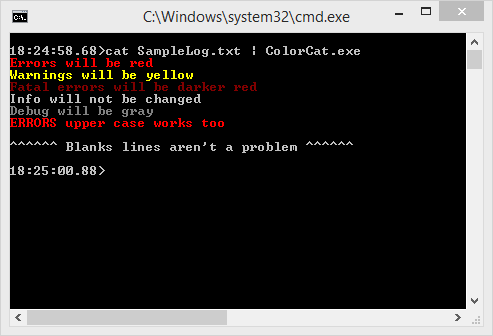

# ColorCat [](https://ci.appveyor.com/project/jquintus/colorcat/branch/master) [](https://chocolatey.org/packages/ColorCat.portable) [](https://chocolatey.org/packages/ColorCat.portable)

A command line tool to add a little color to your console

This tool will read from standard input and output colored text to the console.  For now the colors are hardcoded.




## Usage

### Basic Usage

To colorize the output of another program (such as tail or cat) simply pipe into colorCat.  

    > tail -f myLogFile | colorCat
    > cat data | colorCat

The first time you do this, if colorCat has not been configured, a default configuration will be created.

### add
Adds a new color mapping filter to your configuration.  

```
  -c, --color         Required. The color to use for the mapping.

  -i, --ignoreCase    Ignore case when executing the mapping.

  -r, --regex         Execute mapping as a regular expression instead of a
                      string compare.

  -v, --verbose       Display configuration after the update

Valid colorss are:
  Black
  DarkBlue
  DarkGreen
  DarkCyan
  DarkRed
  DarkMagenta
  DarkYellow
  Gray
  DarkGray
  Blue
  Green
  Cyan
  Red
  Magenta
  Yellow
  White

Example:
  colorCat add -c red -i error
```

## Downloads
[ColorCat](https://github.com/MasterDevs/ColorCat/releases/download/V0.0.4/bin.zip)
